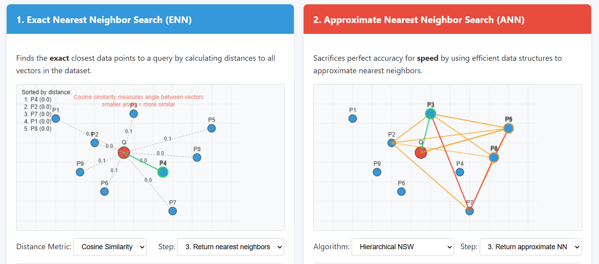
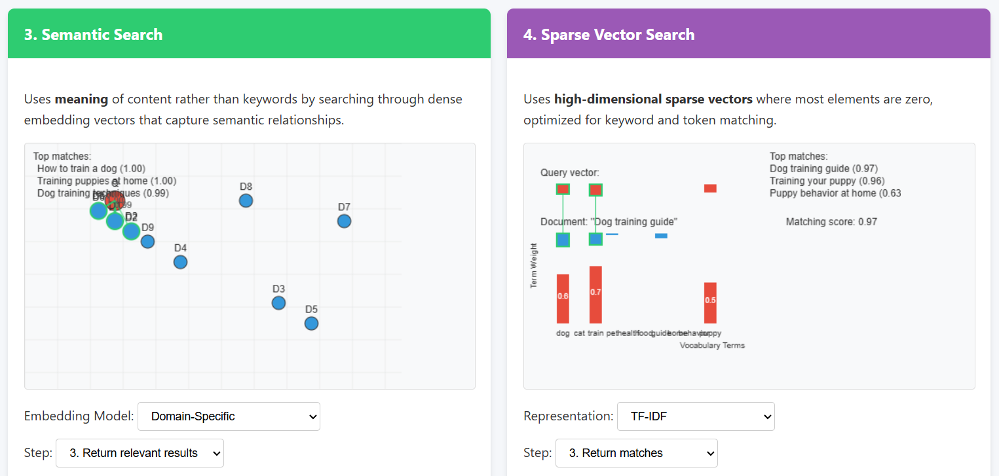

# Vector Search Methods Comparison

[](https://www.linkedin.com/in/pejman-ebrahimi-4a60151a7/)
[](https://huggingface.co/arad1367)
[](https://arad1367.github.io/pejman-ebrahimi/)
[](https://www.uni.li/pejman.ebrahimi?set_language=en)

An interactive visualization comparing four fundamental vector search methodologies: Exact Nearest Neighbor (ENN), Approximate Nearest Neighbor (ANN), Semantic Search, and Sparse Vector Search.

**Live Demo:** [Vector Search Methods Comparison on HuggingFace](https://huggingface.co/spaces/arad1367/Vector_Search_Methods_Comparison)

## Table of Contents
- [Introduction](#introduction)
- [Vector Search Methods](#vector-search-methods)
  - [Exact Nearest Neighbor Search](#exact-nearest-neighbor-search)
  - [Approximate Nearest Neighbor Search](#approximate-nearest-neighbor-search)
  - [Semantic Search](#semantic-search)
  - [Sparse Vector Search](#sparse-vector-search)
- [Features](#features)
- [Installation](#installation)
- [Usage](#usage)
- [Technologies](#technologies)
- [Applications](#applications)
- [Contact](#contact)

## Introduction

Vector search forms the backbone of modern information retrieval and machine learning systems. This interactive visualization tool demonstrates and compares four key vector search methodologies, illustrating their algorithms, strengths, limitations, and applications.



## Vector Search Methods

### Exact Nearest Neighbor Search

Exact Nearest Neighbor (ENN) search calculates the precise distance between a query vector and every vector in the dataset to find the true closest matches.

**Key Features:**
- 100% accuracy - finds the true nearest neighbors
- Supports various distance metrics (Euclidean, Manhattan, Cosine)
- Computationally expensive for large datasets (O(n) complexity)
- Becomes inefficient in high dimensions (curse of dimensionality)

### Approximate Nearest Neighbor Search

Approximate Nearest Neighbor (ANN) search sacrifices perfect accuracy for dramatically improved speed by using efficient data structures to approximate the nearest neighbors.

**Key Features:**
- Much faster than ENN for large datasets (sub-linear time complexity)
- Trades accuracy for speed (95-99% accurate typically)
- Implements various algorithms (HNSW, Product Quantization, LSH)
- Requires pre-processing to build index structures



### Semantic Search

Semantic search uses the meaning of content rather than keywords by searching through dense embedding vectors that capture semantic relationships.

**Key Features:**
- Understands meaning beyond exact keyword matches
- Uses dense vector embeddings (typically 768-1536 dimensions)
- Trained on large text corpora to capture language patterns
- Effective for natural language, images, and multimodal content
- Usually implemented with ANN algorithms for efficiency

### Sparse Vector Search

Sparse vector search uses high-dimensional sparse vectors where most elements are zero, optimized for keyword and token matching.

**Key Features:**
- Efficient for exact matching and keyword search
- Very high dimensionality (vocabulary size) but mostly zeros
- Uses specialized inverted index for quick lookup
- Good for precision when exact matches are required
- Often combined with semantic search for hybrid approaches

## Features

- **Interactive Visualizations:** Step through each search method process
- **Customizable Parameters:** Change distance metrics, algorithms, and models
- **Visual Comparisons:** See how each method approaches vector search differently
- **Educational Tool:** Learn about vector search concepts with visual examples
- **Comprehensive Comparison:** Side-by-side evaluation of all four methodologies

## Installation

```bash
# Clone the repository
git clone https://github.com/arad1367/Vector_Search_Methods_Comparison.git

# Navigate to project directory
cd Vector_Search_Methods_Comparison

# Open the HTML file in your browser
open index.html
```

## Usage

1. **Select a Search Method:** Browse through the four search method tabs
2. **Configure Parameters:** Choose distance metrics, algorithms, or models
3. **Step Through Process:** Use the step selector to see each phase of the search
4. **Compare Results:** Observe differences in accuracy, efficiency, and approach

## Technologies

- HTML5
- CSS3
- JavaScript
- Canvas API

## Applications

Vector search methods are foundational to many modern applications:

- **Recommendation Systems:** Product, content, and media recommendations
- **Image & Video Search:** Finding visually similar content
- **Natural Language Processing:** Semantic text search and understanding
- **Anomaly Detection:** Finding outliers in datasets
- **Information Retrieval:** Search engines and knowledge bases
- **E-commerce:** Similar product discovery and catalog navigation
- **Healthcare:** Medical image analysis and similar case retrieval
- **Finance:** Fraud detection and pattern recognition

## Contact

**Dr. Pejman Ebrahimi**  
University of Liechtenstein  
Email: pejman.ebrahimi@uni.li

---

© 2025 Dr. Pejman Ebrahimi, University of Liechtenstein. All rights reserved.
